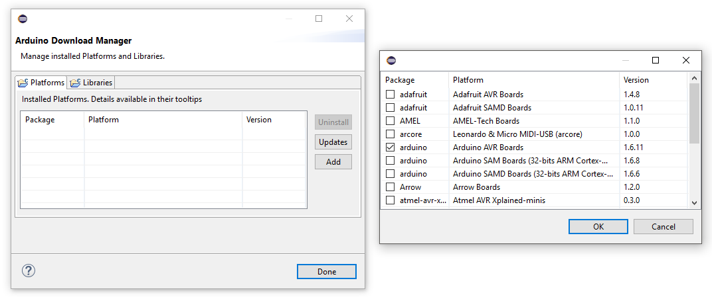
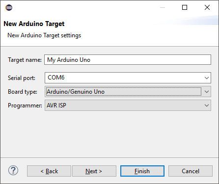

#Arduino Tools Setup

Before starting development for your Arduino you need to install and setup the Arduino toolchain and libraries in your freshly installed Eclipse environment. Open the Arduino Downloads Manager from the Help menu. In the Platforms tab add a new toolchain by clicking the "Add" button and choosing the target platform. In our case it's the Arduino AVR Boards package.

The Arduino toolchain and libraries are now installed. To upload the program to your Arduino you need to connect it to Eclipse. First, connect your Arduino via USB to your computer. If you have connected and used your Arduino with your computer before there should already be a driver installed. If not, make sure you have installed the Arduino IDE from [arduino.cc](https://www.arduino.cc/en/Main/Software), you need it for the USB driver.

There is a wizard that helps you to create a connection to your Arduino. You can open the wizard either by choosing "New Launch Target" from the toolbar or by clicking the "New Connection" button in the "Connections" view of the C/C++ perspective.

On the first wizard page select the Arduino list entry and click "Next>". On the second page provide a name for the connection, the serial port that, and the board type and press "Finish". 

The environment is now ready to compile and upload programs to your Arduino.

Proceed to the [Project Setup](ProjectSetup.md).
