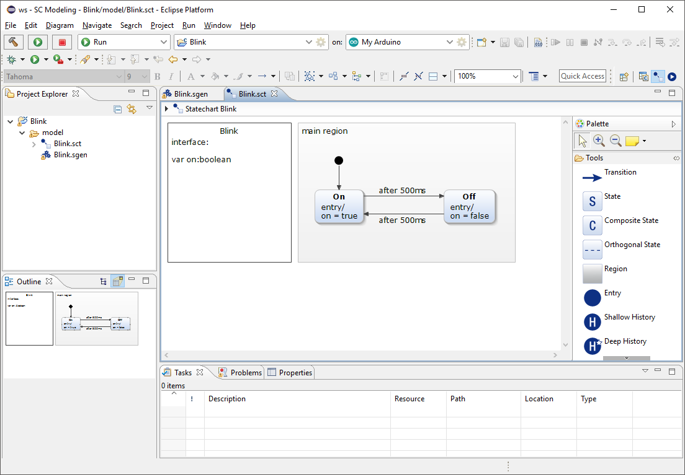
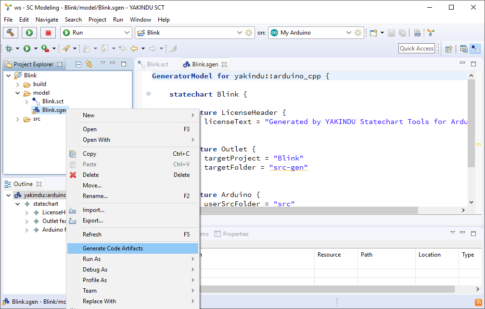
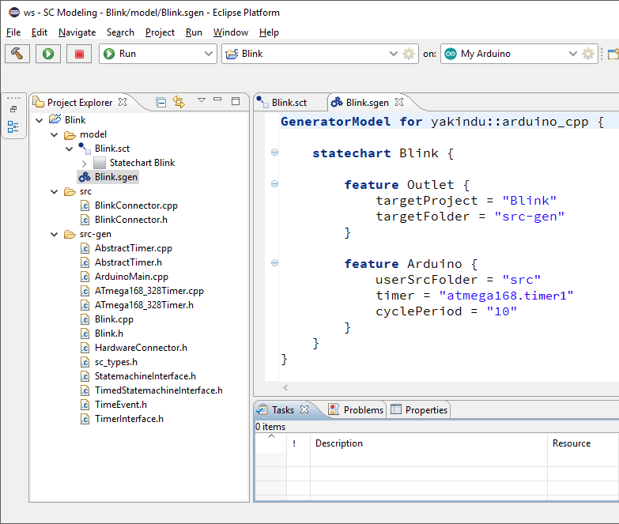
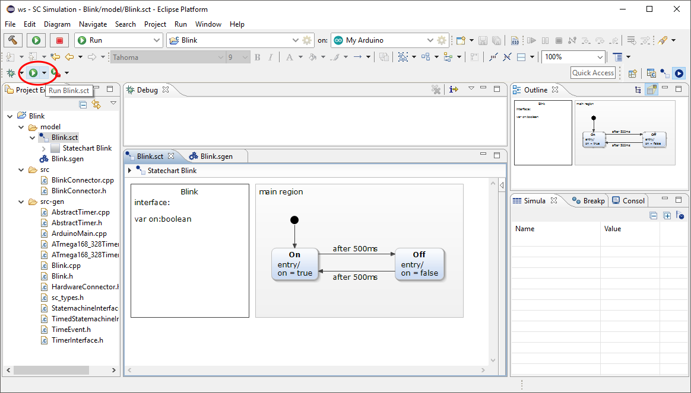
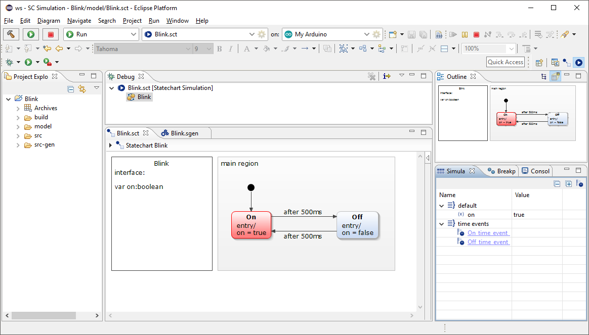
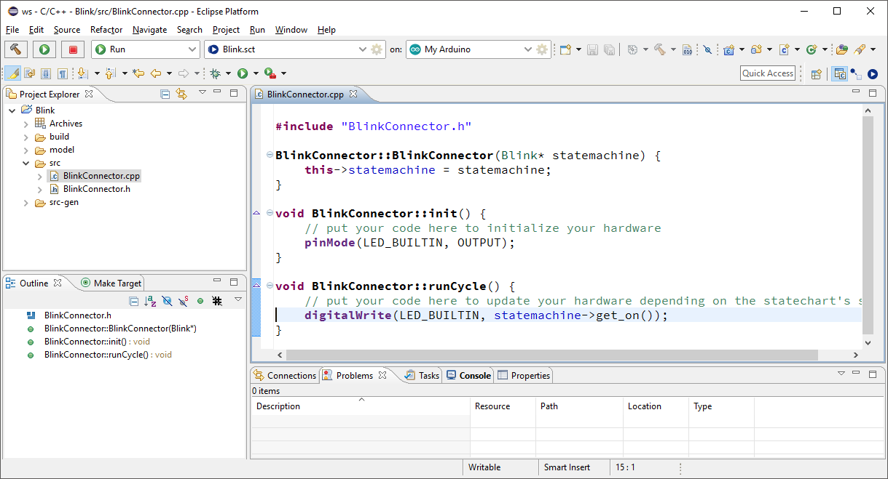
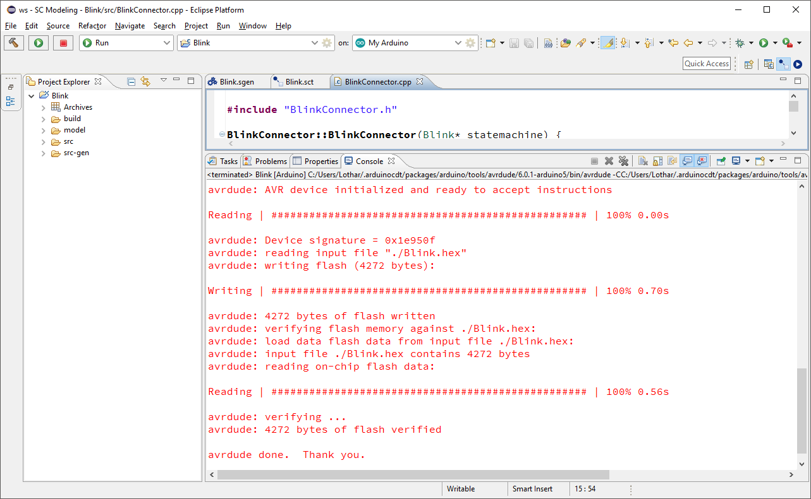

# Programming an Arduino with Statecharts

## Modeling the Statechart

Now we are ready to model the statechart. We will use the "Hello World" example from the Arduino world, it's a blinking light. The Arduino Uno board has an LED built in that can be used for this purpose. In the "Blink" example, we will let the LED turn on and off every 500ms.

Model your statechart in the way that is shown in the figure below. Create two states, <code>On</code> and <code>Off</code>. Then create transitions between both of them and add time triggers to the transitions. The time trigger <code>after 500ms</code> lets the state automatically change after 500 milliseconds. Within the states, add an <code>entry</code> action that sets the boolean variable <code>on</code> to true or respectively to false. You need to declare the boolean variable <code>on</code> within the interface.

You will find a more detailed documentation of the YAKINDU Statechart Tools and the statechart syntax in the Eclipse help or [online](https://www.itemis.com/en/yakindu/statechart-tools/documentation/tutorials/#oss_comprehensive-tutorial). 

## Source code generation

Our statechart model for the "Blink" example is now complete. Open the context menu on the "Blink.sgen" file in the Project Explorer and select "Generate Code Artifacts".

Your Eclipse environment should now look like depicted in the figure below. There are two new folders, "src" and "src-gen". The "src-gen" folder contains the statemachine generated from the statechart, interfaces to the statemachine, a timer implementation, and everything else that is needed to execute the statemachine on your Arduino. The "src" folder is meant to be changed by the developer. We will go into detail later.

You don't have to care about the code that is put into the "src-gen" folder. It is completely generated and will be overwritten the next time when the statechart changes.

## Simulation

This is a pretty simple statechart, you can easily check by hand whether it works as you expect. Once the statechart gets more complex, it's better to check its behavior by simulation. Switch to the SC Simulation perspective and start the simulation of the statechart by clicking on the "Run" button in the toolbar as depicted below.

Now the statechart will be simulated. The current state(s) of the statechart will be highlighted in red. On the right, variables and their values as well as events are shown in the Simulation view. You might even manipulate variables or send events manually in the Simulation view.

For more details about simulation refer to the YAKINDU Statechart Tools pages in the Eclipse help.

## Connecting the Statechart Model with the Hardware

Once you are sure that your statechart works as expected you still need to do some programming. In the "src-gen" folder there is a file called "ArduinoMain.cpp". This file contains the <code>setup</code> and <code>loop</code> functions that have to be implemented in each Arduino sketch. These functions are already implemented and contain everything that is needed to run the statemachine on your Arduino.

Unfortunately, you still need to program the code that connects the statemachine to the Arduino hardware. In the "src" folder you will find two other files, "BlinkConnector.h" and "BlinkConnector.cpp" (the prefixes may differ, the class is named after the statechart). In the "BlinkConnector.cpp" file you will find two methods, <code>BlinkConnector::init()</code> and <code>BlinkConnector::runCycle()</code>. They correspond to the <code>setup</code> and <code>loop</code> functions in ordinary Arduino sketches. 

Put everything that is needed to initialize your hardware into the <code>BlinkConnector::init()</code> function and everything that is needed to be executed regularly into the <code>BlinkConnector::runCycle()</code> method. In this example, you need to turn the built-in LED on the Arduino Uno board to on or off depending on the statechart's state. First of all you need to initialize the <code>LED_BUILTIN</code> pin as an <code>OUTPUT</code> pin. In the <code>runCycle</code> loop you then need to update the pin's level depending on the statechart's <code>on</code> variable to switch the LED on or off. 

The Arduino hardware is now connected to the statemachine running on your Arduino. It's time to upload the program. 

## Uploading the Program

Click on the "Launch in 'Run' Mode" button to upload the code to your Arduino. Be sure to connect your Arduino to your computer and select the correct launch target in the toolbar.

If the upload was successfull the output should look like this:

Now it's your turn to model more complex statecharts and run them on your Arduino. Have fun!
