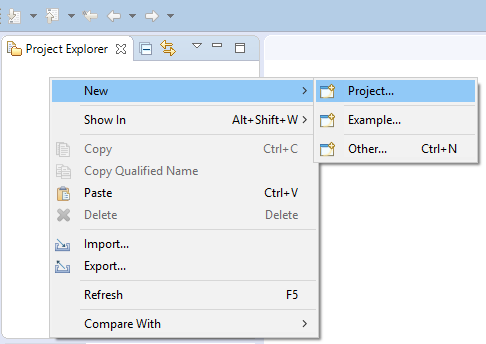
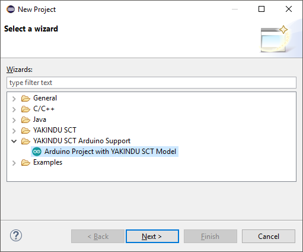
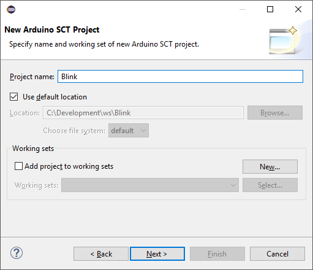
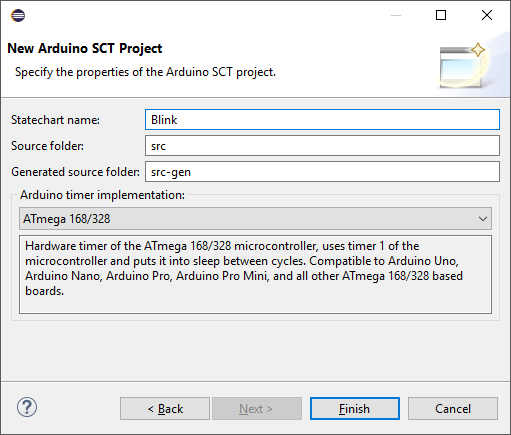
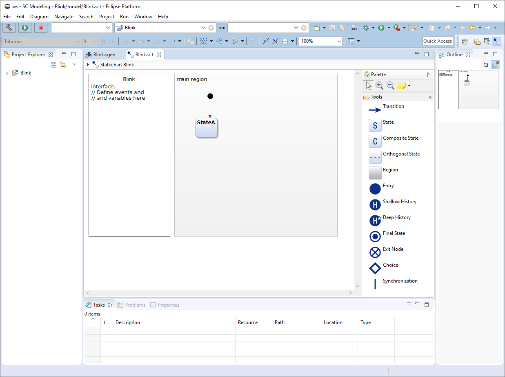

#Project Setup

To start programming your Arduino, you need to create a project. After closing the Welcome page open the context menu of the Project Explorer view in the upper left corner of the Eclipse Window. Select "New">"Project...".

Select "Arduino Project with YAKINDU SCT Model" from the list on the first page of the New Project wizard and click "Next>".

On the next page, choose a project name and click "Next>".

On the last page you can choose values for a set of properties of the Arduino SCT project. These are

* a name for the statechart. The default is the project name. You can choose any valid C++ identifier, since it will be used as a class name.
* a source code folder - it will contain the source code that will be edited by you. Initially, two files will be generated and put into this folder, <StatechartName>Connector.h and <StatechartName>Connector.cpp. After the first code generation these files will be kept untouched by the code generation.
* a generated source code folder - it will contain all the rest of the source code generated by the tool that is necessary to run your statechart on the Arduino. The source code in this folder should not be changed by the user and will be overwritten by the code generator.
* the timer implementation - currently, there are two timer implementations to run the cycles of the statechart. You can choose between a software based timer that is compatible to all kinds of Arduinos and a hardware based timer of the ATmega168 and ATmega328 microcontrollers.

After setting the properties, click "Finish".

You might be asked whether the Xtext nature should be added to the project. Please confirm this question.

Your Eclipse should look like this:

Proceed to [Programming an Arduino with statecharts](ProgrammingArduino.md).
